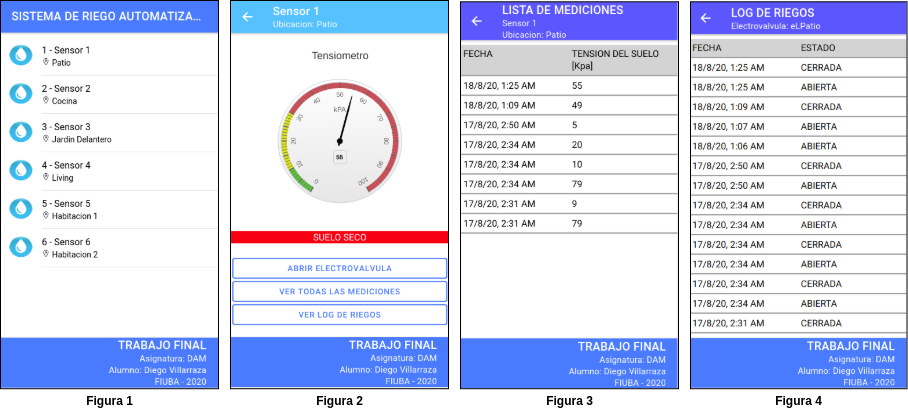

Autor: Diego Villarraza - Agsoto 2020
## Introduccion

Esta aplicación fue creada para el trabajo final de la asignatura Desarrollo de Aplicaciones Multiplataforma de la carrera de Especialización de Internet de las Cosas de FIUBA.

## 
## Tabla de contenido
* [Descripcion de la aplicacion](#descripción-de-la-aplicacion)
* [Instalar dependencias](#instalar-dependencias)
* [Correr la aplicación](#correr-la-aplicación)
* [Contribuir](#contribuir)
* [Licencia](#licencia)

## 
## Descripción de la aplicacion
Consta de dos partes:
    - Una API en express alojada en un contenedor docker que se comunica con otro contendedor donde corre el servidor mysql con la base de datos. - La alpicacion principal desarrollada con Ionic Angular. 

Detalle del funcionamiento de la aplicacion:

Consiste en la simulación de un sistema de riegos automatizado, la figura 1 muestra la pantalla principal de la aplicacion donde se muestra una lista de lo dispositivos utilizados en el riego. Ingresando en algun dispositivo se depliega la figura 2 donde se muestra el disositivos en particular informando en un instrumento la tension de la humedad del suelo y el estado del suelo, en el caso de ser requerido se puede abrir o cerrar la electrovalvula o ver la lista de mediciones hisotricas (figura 3) o la lista de riegos (figura 4).



## 
## Instalar dependencias
La aplicacion necesita:
* Docker (Pasos de la instalacion en [docmentacion oficial](https://docs.docker.com/get-docker/)).
* Docker-Compose (Pasos de la instalacion en [docmentacion oficial](https://docs.docker.com/compose/install/)).
* Ionic-Angular (Pasos de la instalacion en [docmentacion oficial](https://ionicframework.com/docs/intro/cli/)).

## Correr la aplicación
Despues de clonar el repositorio se debe ir a la carpeta Api_Express:
```sh
cd dam_tp_final/Api_Express
```
Para correr la Api es necesario ejecutar el siguiente comando:
```sh
docker-compose up
```
Una vez que los contenedores se estan ejecutando, desde un web browser se puede desplegar la SPA ingesando a:

http://localhost:8000 
     
Si es necesario administar la base de datos con PHPMyAdmin desde un web browser ingresando a:

http://localhost:8085 

Para detener la aplicación es necesario ejecutar el siguiente comando:
```sh
docker-compose down
```

## Contribuir
Para contribuir realizar un pull request con las sugerencias.
## Licencia
GPL